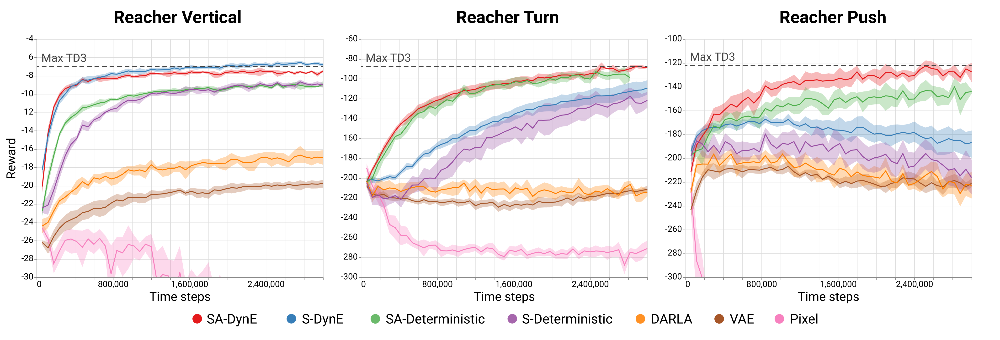

# Dynamics-aware embeddings
This repository contains the code for "Dynamics-aware Embeddings" by William Whitney, Rajat Agarwal, Kyunghyun Cho, and  Abhinav Gupta, which is published at [ICLR 2020](https://www.iclr.cc).

[arXiv link](https://arxiv.org/abs/1908.09357)

[arXiv link](https://arxiv.org/abs/1908.09357)

## Abstract

In this paper we consider self-supervised representation learning to improve sample efficiency in reinforcement learning (RL). We propose a forward prediction objective for simultaneously learning embeddings of states and action sequences. These embeddings capture the structure of the environment's dynamics, enabling efficient policy learning. We demonstrate that our action embeddings alone improve the sample efficiency and peak performance of model-free RL on control from low-dimensional states. By combining state and action embeddings, we achieve efficient learning of high-quality policies on goal-conditioned continuous control from pixel observations in only 1-2 million environment steps. 

DynE works by building an embedding space where actions or states that are close togther have similar outcomes. This smoothness allows the policy and Q function to interpolate between nearby observations or actions, leading to faster convergence.

## Usage

DynE consists of a two-stage process: first learn an embedding of the state and/or action space, then train an agent that uses that embedding. The code for learning embeddings is in `embedding/` and the code for doing RL is in `rl/`.

### Dependencies
All of these experiments use the [MuJoCo physics simulator](http://www.mujoco.org) and [PyTorch](https://pytorch.org). Once those are installed, `pip install mujoco-py gym imagio-ffmpeg` should hopefully get you ready to run experiments.

For visualization I use Jupyter notebooks with [Altair](https://altair-viz.github.io/). To install Altair, do `pip install altair vega_datasets notebook vega`.

### Code style
In the interest of making this code easier to understand and hack on I have sometimes opted to duplicate code in several places instead of factoring it out. I find that research code is typically easier to get a handle on when it contains as little indirection as possible. 

### Training embeddings

To train the DynE action embedding on an environment, run `python main.py --env <gym_env_name>`, e.g. `python main.py --env ReacherVertical-v2`. This should only take a couple of minutes on CPU on a reasonably fast laptop.

To do DynE from pixels to learn state and action embeddings, run `python main_pixels.py --env <gym_env_name>`. This should take 1-2 hours on GPU. To make sure that your state encoder is doing something reasonable you can look at reconstructions in `results/<env name>/<experiment name>/render` as it trains.

You can also train a VAE on pixel observations using `main_vae.py` for use with `main_vae_td3.py`.

You can give your experiments a name with `--name <name>`. If you don't it will be saved as "default".

### Training TD3

You can use DynE embeddings for states, actions, or both. Run `python main_dyne.py --env_name <env> --decoder <name of your embedding run>` with the appropriate options:

- Use `--policy_name DynE-TD3` for DynE action embeddings and raw state observations
- Use `--policy_name TD3 --pixels` for DynE state embeddings and raw actions ("S-DynE-TD3")
- Use `--pixels --policy_name DynE-TD3` for embedded states and actions ("SA-DynE-TD3")

You can compare with regular TD3 by using `main_td3.py`, with TD3 from pixels using `main_pixel_td3.py`, or with TD3 from pixels but using a pretrained VAE encoder using `main_vae_td3.py`.

To see the results, run `jupyter notebook` from the root directory (`dynamics-aware-embeddings`) and open `rl_plots.ipynb`. This notebook contains functions for loading and preprocessing data as well as generating interactive plots.

## Issues and contributions

If you have any issues running this code, please create an issue or (better yet!) a pull request. I really appreciate any bug fixes or improvements you may have!
